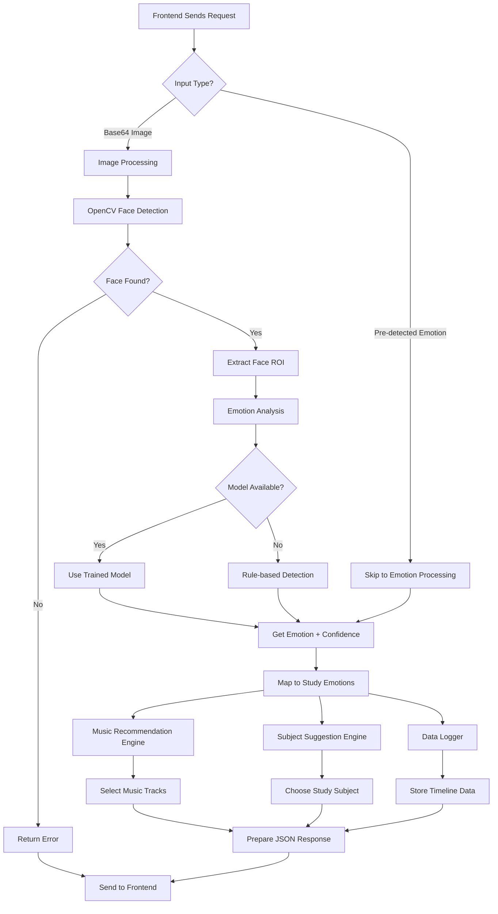

# 🔄 Backend Flow Diagram

## Simple Backend Flow (Step-by-Step)

```
📷 Camera Input → 🔍 Face Detection → 😊 Emotion Analysis → 🎵 Music Recommendation → 📚 Subject Suggestion → 📊 Data Logging → 📤 JSON Response
```

## Detailed Backend Architecture



## Component Breakdown

### 1. **Input Processing** (`app.py`)
```
📥 Receives Request
├── Base64 Image → Decode to OpenCV format
├── Pre-detected Emotion → Direct processing
└── Validation → Error handling
```

### 2. **Emotion Detection** (`emotion_detector.py`)
```
🔍 Face Detection (OpenCV)
├── Haar Cascade Classifier
├── Face Region Extraction
└── Multiple Face Handling

😊 Emotion Analysis
├── Trained Model (Optional)
├── Rule-based Fallback
└── Confidence Scoring
```

### 3. **Music Recommendation** (`music_recommender.py`)
```
🎵 Music Engine
├── Emotion → Music Mapping
├── Track Database (40+ songs)
├── Genre Classification
└── Study Benefits Analysis
```

### 4. **Subject Suggestion** (`subject_suggester.py`)
```
📚 Subject Engine
├── Emotion → Study Mapping
├── Engineering Branch Support
├── Time-based Recommendations
└── Study Duration Suggestions
```

### 5. **Data Logging** (`data_logger.py`)
```
📊 Timeline Storage
├── JSON File Storage
├── Emotion Statistics
├── Trend Analysis
└── Session Summaries
```

## Flow States

### **Happy State Flow**
```
😊 Happy Detected
├── Music: Pop, Dance, Electronic
├── Subject: Advanced Programming, ML Projects
├── Duration: 60-90 minutes
└── Tips: Tackle challenging concepts
```

### **Stressed State Flow**
```
😰 Stressed Detected
├── Music: Lo-fi, Ambient, Calming
├── Subject: Basic Math, Easy Practice
├── Duration: 20-30 minutes
└── Tips: Take breaks, avoid pressure
```

### **Sad State Flow**
```
😢 Sad Detected
├── Music: Acoustic, Soft Rock
├── Subject: Review, Theory Reading
├── Duration: 30-45 minutes
└── Tips: Be gentle, familiar topics
```

### **Neutral State Flow**
```
😐 Neutral Detected
├── Music: Instrumental, Focus
├── Subject: Regular Coursework
├── Duration: 45-60 minutes
└── Tips: Steady progress, balanced
```

## API Response Flow

### **Success Response Structure**
```json
{
  "emotion": "happy",
  "confidence": 0.85,
  "music": {
    "tracks": ["Song 1", "Song 2"],
    "genres": ["Pop", "Dance"],
    "characteristics": "Energetic, Fast beats"
  },
  "subject": {
    "primary_recommendation": "Advanced Programming",
    "reasoning": "High energy perfect for challenges",
    "study_duration": "60-90 minutes"
  },
  "timestamp": "2024-01-15T10:30:00"
}
```

### **Error Response Flow**
```
❌ Error Scenarios
├── No face detected → "Could not detect emotion"
├── Invalid image → "Image processing failed"
├── Missing data → "No data provided"
└── Server error → "Internal server error"
```

## Data Flow Timeline

### **Real-time Processing**
```
1. Request received (0ms)
2. Image decoded (50ms)
3. Face detection (100ms)
4. Emotion analysis (200ms)
5. Recommendations generated (250ms)
6. Data logged (300ms)
7. Response sent (350ms)
```

### **Data Storage Flow**
```
📊 Emotion Entry
├── Timestamp
├── Emotion + Confidence
├── Date/Time breakdown
└── Additional metadata

📈 Statistics Update
├── Total detections
├── Most common emotion
├── Daily averages
└── Trend analysis
```

## Integration Points

### **Frontend Integration**
```
Next.js Frontend ↔ Python Backend
├── POST /detect-emotion (Main endpoint)
├── GET /emotion-timeline (Graph data)
├── POST /clear-timeline (Reset data)
└── GET /health (Status check)
```

### **Camera Integration Options**
```
📷 Option 1: Frontend captures → Send to backend
📷 Option 2: Backend direct camera access
📷 Option 3: Hybrid approach (recommended)
```

## Scalability Considerations

### **Current Architecture** (Development)
```
Single Flask Server
├── JSON file storage
├── In-memory processing
└── Simple rule-based detection
```

### **Production Architecture** (Scalable)
```
Load Balanced Flask Servers
├── Database storage (PostgreSQL)
├── Redis caching
├── ML model serving
└── Microservices architecture
```

---

## 🎯 Perfect for Project Documentation

This diagram shows:
- ✅ **Clear data flow** for viva presentations
- ✅ **Component separation** for code organization  
- ✅ **Error handling** paths
- ✅ **Scalability** considerations
- ✅ **Integration** points with frontend

**Use this diagram in your project report and presentations! 📊**
